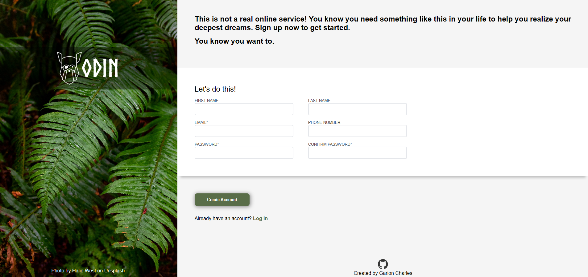

# sign-up-form

## Introduction

This is the first project in The Odin Project's Node path. Its purpose is to demonstrate how to use HTML and CSS to create forms, utilizing input, label, and other semantic tags to ensure accessibility for all users.

## Tech Stack

- HTML
- CSS
- VS-CODE
- UNSPLASH

## Skills Demonstrated 

- Utilized HTML to Properly Layout and Structure Form Elements. 
- Link form input fields to label fields for screenreaders accessibility.  
- Utilization of proper semantic tags for increase accessibility and SEO.
- Implemented appropriate CSS styles for increase Readability and UI/UX experience.
- Implemented Form Validation using Regex for strong password creation. 
- Imported Custom Fonts and converted its file type to Web Open Font format for further performance  optimization. 
- Utilized Unsplash image and provided proper attribution to the creator. 

## Form Design

## Image Attribution

Photo by [Halie West](https://unsplash.com/@haliewestphoto?utm_source=unsplash&utm_medium=referral&utm_content=creditCopyText) on [Unsplash](https://unsplash.com/photos/green-leaf-plant-in-close-up-photography-25xggax4bSA?utm_source=unsplash&utm_medium=referral&utm_content=creditCopyText)

      